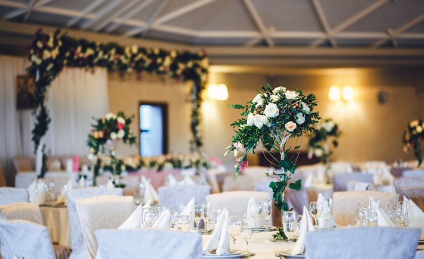

DOCTYPE html>
<html lang="pt-br">
<head>
<meta charset="UTF-8">
<meta name= "autor " content= "autor do site: Dayane">
<meta name=" descrição"content= "Decorações de festas" >
<meta name="viewport" content="width=device-width, initial-scale=1.0">
<title> Tavares Decorações </title>
<link rel="stylesheet" href="styles.css">

</head>
<body class="corpo">
<header>

</header>
<li class="menu principal">

</li>
<section class="quadro 1">
<article class="texto principal">
<h1> Tavares decorações</h1>
Decorações de eventos
</section>

<section class="quadro 2">
<article>
<h1> marcas vendidas</h1>
Nessa parte substitua com itens que você irá vender ou informar em seu site:
<li class= "item 1"> casamentos </li>
<li class=" item 2"> kit festas</li>
<li class=" item 3"> aniversários</li>
<li class=" item 4"> decorações </li>
</article>

</section>
<section class="tabela">

<table>
<tr>
<td></td>

<td></td>

<td></td>

<td></td>

</tr>
</table>

</section>
</body>
</html>
